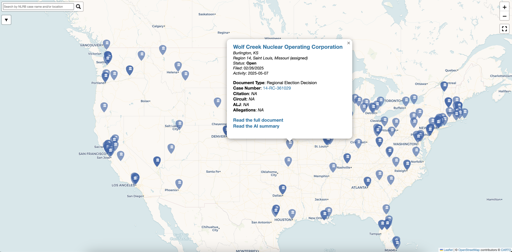
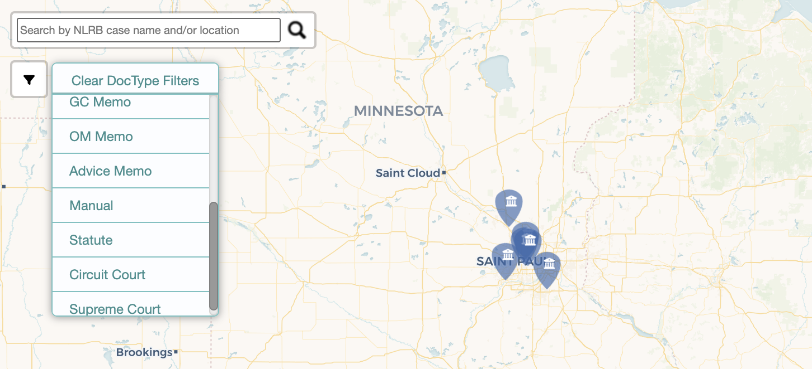

# NLRB Research Map View

## NLRB Research

Per [NLRB Research](https://nlrbresearch.com/about):

> Through its decisions and rulemakings, the National Labor Relations Board creates the labor law that governs unionization and worker rights in the private sector...The NLRB releases its decisions, memos, and other legal documents on its website, but not in a way that is conducive to fast and effective research...The NLRB Research database is a collection of all of the legal documents released by the NLRB on its website.

The database allows for search querying, along with fairly extensive advanced set logic. Given that these documents are related to cases across the country, I thought it would be cool to plot all the cases on a map. And that's what this is.

## The Process

As of now, data is first queried from [NLRB Research](https://nlrbresearch.com/NLRB/NLRB_DB) for the two most recent years (in this case, 2024 and 2025) and scraped. See ['data/nlrb_2024_and_2025.json'](/data/nlrb_2024_and_2025.json) for this data.

Next I filter out observations without a known case number, as that's what I'll be using to get coordinates. Now, with the case numbers, I go to the associated NLRB page and collect the location and NLRB regional office assigned, as well as some other information (e.g., date filed, status, allegations). With the location data, I use [Nominatim](https://nominatim.org/) (the software powering [OpenStreetMap](https://www.openstreetmap.org/about)) to get lons/lats for the city-state of each case. Given that some cases will overlap, I add a small jitter to the coordinates. 

Note that if a case is included more than once in the database (e.g., multiple documents associated with the case), then I show the most recent document from that case. Furthermore, I only show cases that are still open.

For the map, I use [Folium](https://python-visualization.github.io/folium/latest/), which is surprisingly very easy to work with (though unsurprising given its inspiration). Folium allows for a very extensive customization of popups, along with various plug-ins which were pretty helpful.

Enough about the process, let's get to the map.

## The Page & Map 

I embedded the map in a simple page ([CLICK HERE](https://rhawrami.github.io/nlrb_loc/docs/index.html)), with similar information included there as included here.

To just view the map ([LINK HERE](https://rhawrami.github.io/nlrb_loc/docs/NLRB_map.html)), it's public, and should be fairly straightforward. Still, I'll give a brief overview.

Each marker on the map represents an NLRB document with a known case number, with each popup covering the case's:

- location and assigned regional office
- date filed and recent activity
- document type (see [NLRB Research here](https://nlrbresearch.com/instructions) for the available document types)
- case number, with link to NLRB case page
-  citation, circuit, ALJ (admin. law judge) and allegations, if available

In the top left, you can filter by document type: 

You can also search in the top left by the case name and/or case location (e.g., Starbucks, Los Angeles). Note that the search feature isn't very powerful, but it should be fine for our purposes:

